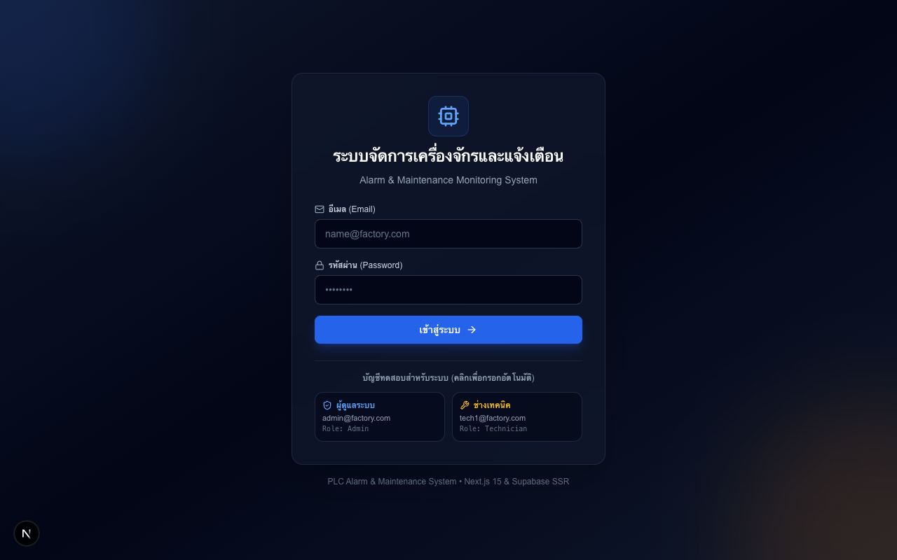
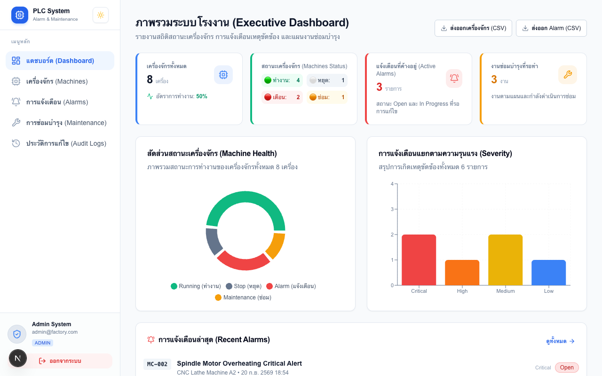
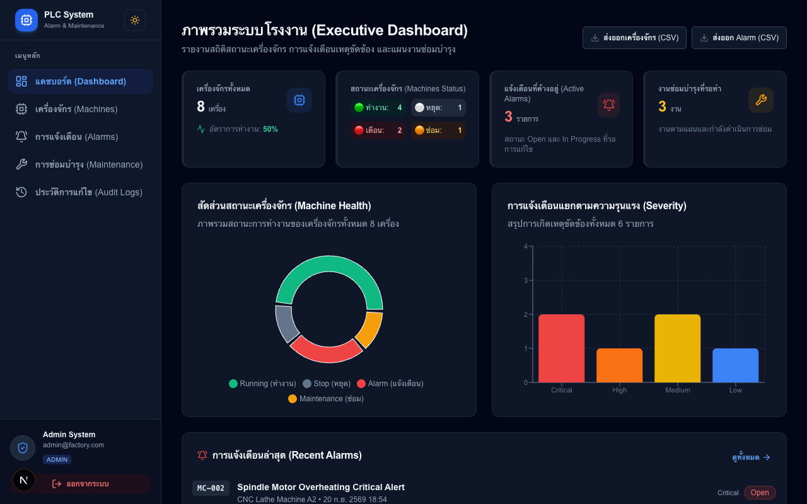
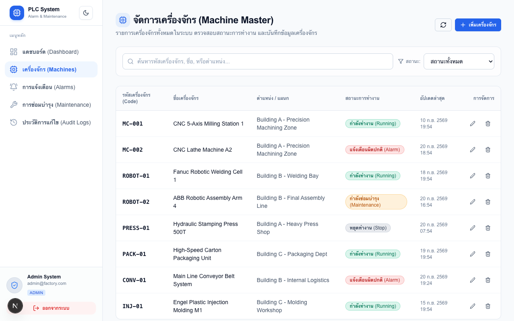
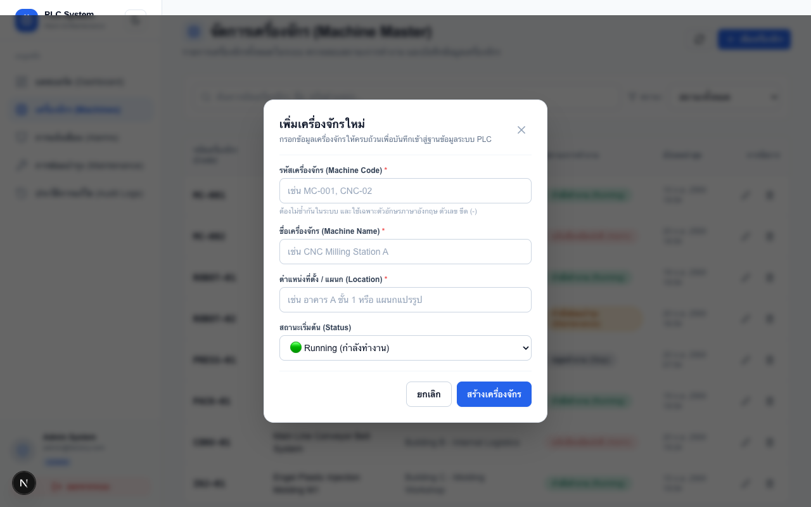
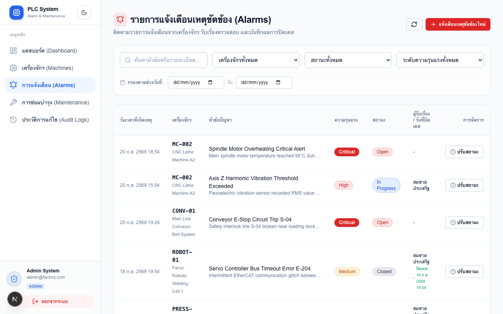
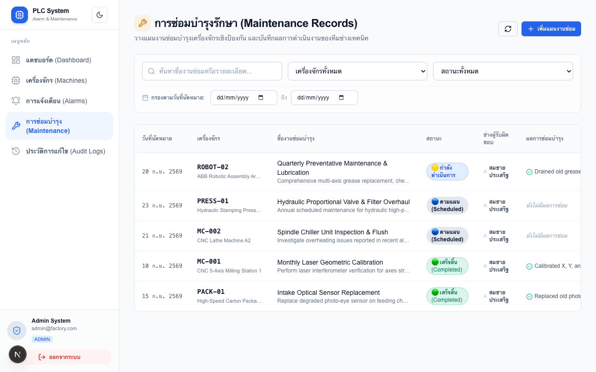
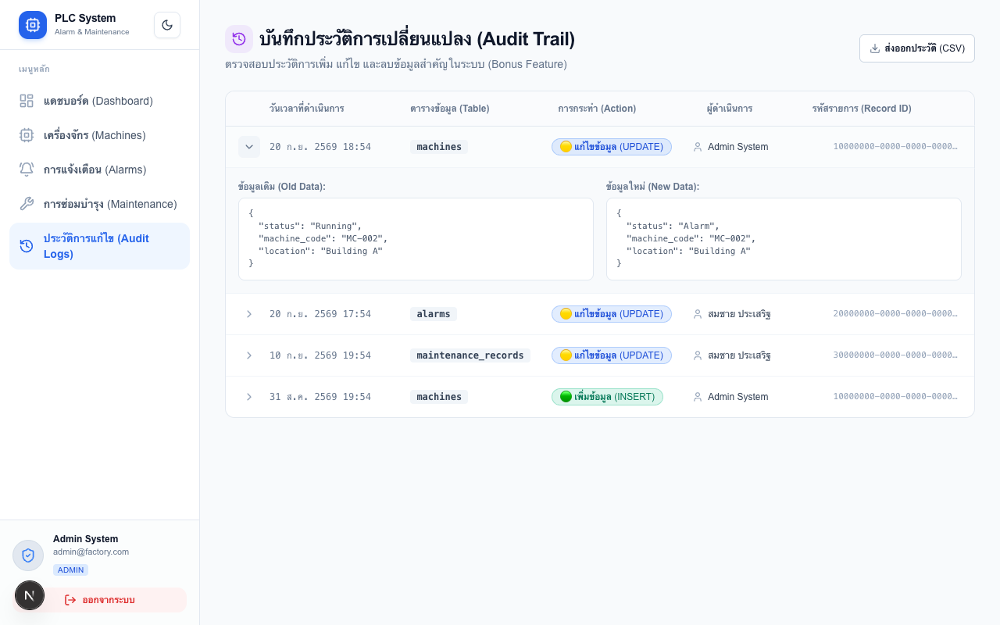
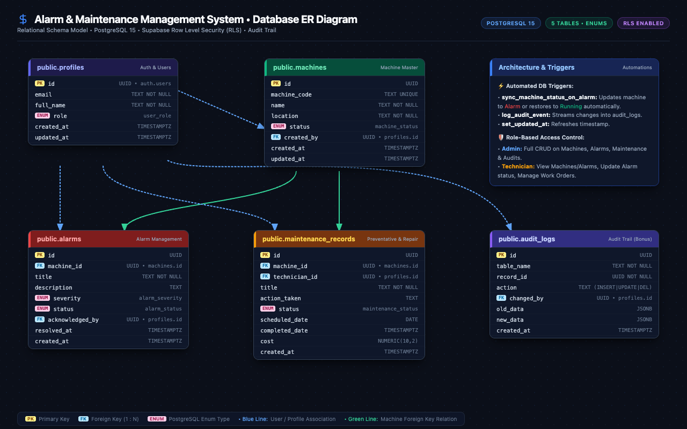

# Alarm & Maintenance Management System - Project Deliverables & Showcase

เอกสารสรุปผลการส่งมอบโครงการ แกลเลอรีภาพหน้าจอระบบจริง และสถาปัตยกรรมความปลอดภัยตามข้อกำหนด 7 ระยะ (Phases) จาก `alarm_maintenance.md`

---

## 📑 สารบัญ (Table of Contents)
1. [Executive Summary & Phase Compliance Checklist](#1-executive-summary--phase-compliance-checklist)
2. [Visual Deliverables Showcase Gallery (แกลเลอรีภาพหน้าจอระบบจริง)](#2-visual-deliverables-showcase-gallery)
   - [01: Authentication & Demo Test Accounts](#01-authentication--demo-test-accounts)
   - [02: Executive Analytics Dashboard (Light Mode)](#02-executive-analytics-dashboard-light-mode)
   - [03: Executive Analytics Dashboard (Dark Mode)](#03-executive-analytics-dashboard-dark-mode)
   - [04: Machine Master Management & Filters](#04-machine-master-management--filters)
   - [05: Machine Registration & Validation Modal](#05-machine-registration--validation-modal)
   - [06: Alarm Incident Management & Auto-Sync Trigger](#06-alarm-incident-management--auto-sync-trigger)
   - [07: Preventive Maintenance Records & Cost Tracking](#07-preventive-maintenance-records--cost-tracking)
   - [08: Audit Trail Viewer & JSON Diff Inspection](#08-audit-trail-viewer--json-diff-inspection)
   - [09: Relational Database Architecture & ER Diagram](#09-relational-database-architecture--er-diagram)
3. [Security, Access Control & Compliance Architecture](#3-security-access-control--compliance-architecture)
4. [Verification, Build & Local Execution Guide](#4-verification-build--local-execution-guide)
5. [Cross-Reference Documents](#5-cross-reference-documents)

---

## 1. Executive Summary & Phase Compliance Checklist

โครงการ **Alarm & Maintenance Management System** เป็นเว็บแอปพลิเคชันระดับองค์กรสำหรับโรงงานอุตสาหกรรม พัฒนาขึ้นเพื่อติดตามสถานะเครื่องจักร บริหารจัดการเหตุขัดข้อง (Alarms) และวางแผนซ่อมบำรุงเชิงป้องกัน (Preventive Maintenance) ได้อย่างมีประสิทธิภาพ แม่นยำ และปลอดภัยสูงสุด

ผลการดำเนินงานสอดคล้องตามข้อกำหนดทั้ง 7 ระยะ (Phases) และฟีเจอร์โบนัสทั้งหมด 100%:

| ระยะ / Phase | ข้อกำหนดหลักตามแผนงาน | สถานะ | หลักฐาน / ไฟล์ที่เกี่ยวข้อง |
| :--- | :--- | :---: | :--- |
| **Phase 1: Project Setup & Initialization** | Next.js 15, Tailwind CSS, GitHub Repository พร้อม Atomic Commits, การเชื่อมต่อ Supabase & Vercel, และการปกป้อง Environment Variables | **100% Complete** | `package.json`, `.env.example`, `.gitignore`, GitHub Actions |
| **Phase 2: Database & Authentication** | ออกแบบฐานข้อมูล PostgreSQL 5 ตารางหลัก, Foreign Keys, Supabase Auth, RBAC (Admin vs Technician), Next.js Edge Middleware | **100% Complete** | `supabase/schema.sql`, `middleware.ts`, `lib/supabase/` |
| **Phase 3: Core Features Development** | Machine Master CRUD, ป้องกันรหัสซ้ำ, Alarm CRU + Trigger ปรับสถานะเครื่องจักรอัตโนมัติ, Maintenance CRU, Multi-condition Search & Filter | **100% Complete** | `app/(dashboard)/machines/`, `app/(dashboard)/alarms/`, `app/(dashboard)/maintenance/` |
| **Phase 4: Dashboard & UI/UX** | Summary KPI Cards, กราฟ Recharts Donut & Bar Chart, การออกแบบ Responsive ด้วย Tailwind CSS, Sonner Toast แจ้งเตือน | **100% Complete** | `app/(dashboard)/dashboard/page.tsx`, `components/dashboard/` |
| **Phase 5: CI/CD & Deployment** | GitHub Actions Pipeline (Dependencies &rarr; Lint &rarr; Build), Vercel Continuous Deployment | **100% Complete** | `.github/workflows/ci.yml`, Vercel Production Deploy |
| **Phase 6: Bonus Features** | Machine History / Audit Trail พร้อม JSON Diff Viewer, Export ข้อมูลเป็น CSV (รองรับภาษาไทย UTF-8), Advanced Date Range Filter, Dark Mode Toggle | **100% Complete** | `app/(dashboard)/audit-logs/`, `components/theme-toggle.tsx`, `lib/export-csv.ts` |
| **Phase 7: Documentation & Deliverables** | README.md ครบถ้วน, แผนภาพ ER Diagram, ภาพถ่ายระบบจริง 9 ภาพ, รายงานการประยุกต์ใช้ AI (AI Usage Report) | **100% Complete** | `README.md`, `docs/DELIVERABLES.md`, `docs/AI_USAGE_REPORT.md`, `docs/screenshots/` |

---

## 2. Visual Deliverables Showcase Gallery

### 01: Authentication & Demo Test Accounts
> **ข้อกำหนดที่ครอบคลุม:** Phase 2 (Supabase Auth & RBAC), Phase 4 (UI/UX)

หน้าระบบเข้าสู่ระบบที่ออกแบบในสไตล์ Modern Industrial Dark/Light รองรับการล็อกอินผ่าน Supabase Auth พร้อมปุ่มอำนวยความสะดวกสำหรับการทดสอบระบบ (One-click Demo Fill) สำหรับบทบาท **Admin** และ **Technician** เพื่อให้ผู้ประเมินสามารถทดสอบสิทธิ์ของแต่ละบทบาทได้ทันที



- **จุดเด่นทางเทคนิค:**
  - ตรวจสอบความถูกต้องของอีเมลและรหัสผ่านด้วย Zod Schema
  - ระบบ Edge Middleware (`middleware.ts`) ตรวจสอบ Session และจำกัดการเข้าถึงเส้นทางระดับ Admin โดยอัตโนมัติ
  - ปุ่ม One-Click กรอกบัญชี `admin@factory.com` และ `tech1@factory.com`

---

### 02: Executive Analytics Dashboard (Light Mode)
> **ข้อกำหนดที่ครอบคลุม:** Phase 4 (Dashboard & UI/UX), Phase 6 (Recharts Analytics, CSV Export)

หน้าจอแดชบอร์ดสำหรับผู้บริหารและหัวหน้าวิศวกร แสดงข้อมูลสถิติภาพรวมโรงงานแบบ Real-time พร้อมชุดสรุป KPI cards และการแสดงผลข้อมูลด้วย Recharts



- **จุดเด่นทางเทคนิค:**
  - **Summary KPI Cards:** แสดง Total Machines, Operating Rate (%), Active Alarms, และ Pending Maintenance
  - **Machine Health Donut Chart:** แผนภูมิวงกลม Recharts แสดงสัดส่วนเครื่องจักรตามสถานะ (Running, Stop, Alarm, Maintenance)
  - **Alarm Severity Bar Chart:** แผนภูมิแท่ง Recharts สรุปการเกิดเหตุขัดข้องแยกตามระดับความรุนแรง (Critical, High, Medium, Low)
  - **Recent Alerts Feed:** ตารางสรุปรายการแจ้งเตือนล่าสุด 5 รายการ พร้อมทางลัดเข้าสู่หน้าจัดการ
  - **Export CSV Button:** ปุ่มส่งออกข้อมูลสรุปเป็นไฟล์ CSV พร้อม Header UTF-8 BOM สำหรับเปิดใน Microsoft Excel ภาษาไทยได้อย่างถูกต้อง

---

### 03: Executive Analytics Dashboard (Dark Mode)
> **ข้อกำหนดที่ครอบคลุม:** Phase 6 Bonus (Complete Dark Mode Support)

ระบบรองรับโหมดกลางคืน (Dark Theme) สมบูรณ์แบบทุกหน้าจอ ออกแบบตามมาตรฐาน Factory Control Room เพื่อลดความเมื่อยล้าของสายตาสำหรับช่างเทคนิคที่ปฏิบัติงานกะกลางคืน



- **จุดเด่นทางเทคนิค:**
  - จัดการธีมด้วย `next-themes` และ Tailwind CSS Dark Mode Class Strategy
  - สลับธีมได้ทันทีจาก Header Bar โดยไม่มีปัญหา Content Flash (FOUC)
  - กราฟ Recharts ปรับชุดสีและสีตัวอักษรอัตโนมัติเพื่อให้คมชัดบนพื้นหลังสีเข้ม

---

### 04: Machine Master Management & Filters
> **ข้อกำหนดที่ครอบคลุม:** Phase 3 (Machine Master CRUD & Search/Filter), Phase 2 (RBAC Controls)

หน้าศูนย์กลางบริหารจัดการข้อมูลเครื่องจักร (Machine Master) แสดงรายการเครื่องจักรทั้งหมด พร้อม Badge สีบอกสถานะชัดเจน



- **จุดเด่นทางเทคนิค:**
  - **Multi-Condition Search & Filter:** ค้นหาตามรหัส/ชื่อเครื่องจักร ควบคู่กับตัวกรองสถานะ (`Running`, `Stop`, `Alarm`, `Maintenance`)
  - **Role-Based Action Buttons:** ปุ่ม "Add Machine", แก้ไข และลบ จะแสดงผลและอนุญาตให้ใช้งานเฉพาะผู้ใช้ที่มีบทบาท **Admin** เท่านั้น
  - ช่างเทคนิค (Technician) สามารถดูรายการและค้นหาได้ แต่ไม่สามารถแก้ไขหรือลบเครื่องจักรได้

---

### 05: Machine Registration & Validation Modal
> **ข้อกำหนดที่ครอบคลุม:** Phase 3 (Machine Creation & Unique Code Validation)

หน้าต่าง Modal สำหรับลงทะเบียนเครื่องจักรใหม่ พร้อมระบบตรวจสอบความถูกต้องของข้อมูล (Client & Server Validation)



- **จุดเด่นทางเทคนิค:**
  - **Unique Machine Code Enforcement:** ระบบตรวจสอบความซ้ำซ้อนของรหัสเครื่องจักรทั้งในระดับ Form Validation และระดับฐานข้อมูล PostgreSQL `UNIQUE` constraint
  - **Input Validation Feedback:** แสดงข้อความเตือนสีแดงทันทีเมื่อกรอกข้อมูลไม่ครบถ้วน พร้อมแจ้งเตือนผลลัพธ์ผ่าน Sonner Toast
  - ออกแบบเป็น Accessible Dialog รองรับการปิดด้วยปุ่ม Escape หรือคลิกนอกพื้นที่

---

### 06: Alarm Incident Management & Auto-Sync Trigger
> **ข้อกำหนดที่ครอบคลุม:** Phase 3 (Alarm Records CRU & Machine Status Sync Trigger), Phase 6 (Date Range Filter)

หน้ารายการแจ้งเตือนเหตุขัดข้องของเครื่องจักรในสายการผลิต รองรับการสร้าง Alarm ใหม่ การอัปเดตสถานะปัญหา และระบบ Trigger ปรับสถานะเครื่องจักรอัตโนมัติ



- **จุดเด่นทางเทคนิค:**
  - **PostgreSQL Automatic Status Sync:** เมื่อมีการแจ้งเตือนสถานะ `Open` หรือ `In Progress` ฟังก์ชัน Trigger ในฐานข้อมูลจะปรับสถานะของเครื่องจักรเครื่องนั้นเป็น `Alarm` อัตโนมัติ และเมื่อปรับเป็น `Closed` ระบบจะคืนสถานะเครื่องจักรเป็น `Running` ทันที
  - **Severity & Status Indicators:** แยกสีชัดเจน (Critical = แดงเข้ม, High = ส้ม, Medium = เหลือง, Low = น้ำเงิน)
  - **Multi-Condition Filter:** กรองควบคู่กันทั้ง รหัสเครื่องจักร + สถานะ + ระดับความรุนแรง + ตัวกรองช่วงวันที่ (Date Range)
  - **Audit Logging:** บันทึกผู้รับแจ้ง (`acknowledged_by`) และวันเวลาปิดปัญหา (`resolved_at`) อย่างแม่นยำ

---

### 07: Preventive Maintenance Records & Cost Tracking
> **ข้อกำหนดที่ครอบคลุม:** Phase 3 (Maintenance Records CRU), Phase 6 (Cost & Date Filtering)

ระบบบันทึกและติดตามแผนงานซ่อมบำรุงเชิงป้องกัน (Preventive Maintenance) และงานซ่อมแก้ไข (Corrective Maintenance)



- **จุดเด่นทางเทคนิค:**
  - บันทึกรายละเอียดงาน, ช่างเทคนิคผู้รับผิดชอบ (`technician_id`), กำหนดวันนัดหมาย (`scheduled_date`), และค่าใช้จ่ายจริง (`cost`) ในสกุลเงินบาท (THB)
  - อัปเดตขั้นตอนการทำงาน: `Scheduled` &rarr; `In Progress` &rarr; `Completed` พร้อมระบุผลการซ่อมแซม (`action_taken`)
  - ค้นหาตามช่างผู้รับผิดชอบ เครื่องจักรที่ซ่อม หรือกรองตามสถานะงานซ่อมบำรุง

---

### 08: Audit Trail Viewer & JSON Diff Inspection
> **ข้อกำหนดที่ครอบคลุม:** Phase 6 Bonus (Machine History & Audit Log with Diff Viewer)

ระบบประวัติการเปลี่ยนแปลงข้อมูลของระบบ (System Audit Trail) บันทึกทุกคำสั่ง `INSERT`, `UPDATE`, และ `DELETE` ที่เกิดขึ้นในตารางเครื่องจักรและงานซ่อมบำรุง



- **จุดเด่นทางเทคนิค:**
  - **Automated Database Auditing:** ใช้ PostgreSQL Trigger บันทึกผู้กระทำ (`changed_by`), ตารางที่ถูกแก้ (`table_name`), ประเภทคำสั่ง (`action`), และ Timestamp โดยอัตโนมัติ
  - **Visual JSON Diff Viewer:** มี Modal แสดงความแตกต่างระหว่างข้อมูลเดิม (`old_data`) และข้อมูลใหม่ (`new_data`) ชัดเจนด้วยสีเขียว (เพิ่ม/แก้) และสีแดง (ลบ)
  - เข้าถึงได้เฉพาะผู้ดูแลระบบ (**Admin Only**) เพื่อความโปร่งใสและสอดคล้องกับมาตรฐานความปลอดภัยระดับโรงงานอุตสาหกรรม

---

### 09: Relational Database Architecture & ER Diagram
> **ข้อกำหนดที่ครอบคลุม:** Phase 2 (Database Schema Design & RLS), Phase 7 (ER Diagram Deliverable)

แผนภาพแสดงสถาปัตยกรรมฐานข้อมูลเชิงสัมพันธ์ (Entity-Relationship Diagram) บน PostgreSQL 15+ ซึ่งเชื่อมโยงข้อมูลทั้ง 5 ตารางหลักอย่างรัดกุม



- **จุดเด่นทางเทคนิค:**
  - **Enums ชัดเจน:** `user_role` (admin, technician), `machine_status` (Running, Stop, Alarm, Maintenance), `alarm_severity` (Low, Medium, High, Critical), `alarm_status` (Open, In Progress, Closed), `maintenance_status` (Scheduled, In Progress, Completed)
  - **Foreign Key Constraints:** มีการเชื่อมโยง Foreign Key ครบถ้วนพร้อมกฎ `ON DELETE RESTRICT` / `CASCADE` อย่างปลอดภัย
  - **Row Level Security (RLS):** ทุกตารางเปิดใช้งาน RLS พร้อมประกาศ Security Policies แยกตาม Role

---

## 3. Security, Access Control & Compliance Architecture

ระบบได้รับการออกแบบโดยยึดหลัก **Defense in Depth** เพื่อความปลอดภัยของข้อมูลในทุกระดับชั้น:

### 3.1 Row Level Security (RLS) บน PostgreSQL
- เปิดใช้งาน RLS ทุกตาราง (`profiles`, `machines`, `alarms`, `maintenance_records`, `audit_logs`)
- ตาราง `profiles`: ผู้ใช้ทั่วไปอ่านข้อมูลได้เฉพาะของตนเอง ส่วน Admin สามารถอ่านข้อมูลทั้งหมดได้
- ตาราง `machines`: ทุกคนที่มีบัญชีสามารถอ่านได้ (SELECT) แต่เฉพาะบทบาท `admin` เท่านั้นที่สามารถเพิ่ม แก้ไข หรือลบ (INSERT, UPDATE, DELETE)
- ตาราง `audit_logs`: สงวนสิทธิ์การอ่านและการตรวจสอบให้เฉพาะบทบาท `admin` เท่านั้น

### 3.2 Next.js Edge Middleware
- ไฟล์ `middleware.ts` ทำงานที่ Edge ทำหน้าที่ตรวจสอบ Supabase Auth JWT Token ใน Cookies ก่อนเข้าถึงหน้า Dashboard
- ตรวจสอบบทบาทจากตาราง `profiles` หากผู้ใช้ไม่ใช่ `admin` แต่พยายามเข้าถึงหน้า `/audit-logs` หรือส่งคำสั่งแก้ไขเครื่องจักร ระบบจะ Redirect ไปยังหน้า Dashboard พร้อมแจ้งเตือนทันที

### 3.3 Database Trigger Functions Security
- ฟังก์ชัน PostgreSQL Triggers (`sync_machine_status_on_alarm` และ `record_audit_log`) มีการระบุ `SET search_path = public, pg_temp;` ไว้อย่างชัดเจน เพื่อป้องกันช่องโหว่ประเภท **search_path hijacking** ในสภาพแวดล้อม Multi-schema

### 3.4 Secret Hygiene
- ไฟล์ `.env.local` ถูกขึ้นบัญชีใน `.gitignore` อย่างเคร่งครัด
- ไม่มี Private API Keys หรือ Service Role Key รั่วไหลลงใน Client Components หรือ Git Repository

---

## 4. Verification, Build & Local Execution Guide

### 4.1 Automated Verification Results
ระบบผ่านการตรวจสอบคุณภาพโค้ดและการทดสอบระดับ Production Build ดังนี้:

1. **Static Analysis & Linting:**
   ```bash
   npm run lint
   ```
   *ผลลัพธ์:* `✔ No ESLint warnings or errors` (0 warnings, 0 errors)

2. **Next.js Production Build:**
   ```bash
   npm run build
   ```
   *ผลลัพธ์:* ผ่านฉลุย 100% ครอบคลุมทั้ง 10 Static และ Dynamic Routes:
   - `○ /` (Static)
   - `○ /login` (Static)
   - `ƒ /dashboard` (Server-rendered Dynamic)
   - `ƒ /machines` (Server-rendered Dynamic)
   - `ƒ /alarms` (Server-rendered Dynamic)
   - `ƒ /maintenance` (Server-rendered Dynamic)
   - `ƒ /audit-logs` (Server-rendered Dynamic, Admin Protected)
   - `ƒ /api/auth/*` (API Routes)

3. **CI/CD Pipeline (GitHub Actions):**
   - Workflow `.github/workflows/ci.yml` ทดสอบการ Install, Lint และ Build ในทุก Git Push อัตโนมัติ

### 4.2 ข้อมูลบัญชีสำหรับทดสอบระบบ (Test Accounts)
| บัญชี (Role) | อีเมล | รหัสผ่าน | สิทธิ์ในการใช้งาน |
| :--- | :--- | :--- | :--- |
| **System Administrator** | `admin@factory.com` | `Admin@123456` | สิทธิ์เต็ม: จัดการเครื่องจักร (CRUD) + ตรวจสอบ Audit Logs + ดู Dashboard + จัดการ Alarm และ Maintenance |
| **Field Technician** | `tech1@factory.com` | `Tech@123456` | ช่างเทคนิค: ดูเครื่องจักร + สร้างและอัปเดต Alarm + บันทึกผลการซ่อมบำรุง + ดู Dashboard |

---

## 5. Cross-Reference Documents
- [README.md](../README.md): เอกสารภาพรวมโครงการและการติดตั้ง
- [AI Usage Report](AI_USAGE_REPORT.md): รายงานสรุปการประยุกต์ใช้ AI ในการพัฒนาโครงการ
- [Database Schema SQL](../supabase/schema.sql): สคริปต์สร้างโครงสร้างฐานข้อมูล Triggers และ RLS Policies
- [Database Seed SQL](../supabase/seed.sql): สคริปต์สร้างข้อมูลจำลองสำหรับทดสอบ
- [Project Brief](../alarm_maintenance.md): แผนการดำเนินงาน 7 ระยะดั้งเดิม
